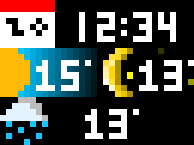

# LIM - Led Information Matrix
32x8 LED RGB Matrix for information display. Running on an NodeMCUv2.

Still in heavy development.

- [LIM - Led Information Matrix](#lim---led-information-matrix)
- [Widgets](#widgets)
  - [Dateclock](#dateclock)
  - [OpenWeather MinMAx](#openweather-minmax)
  - [OpenWeather Current](#openweather-current)
- [Inspiration](#inspiration)
- [Development](#development)
  - [Fixing Linking Errors with AsyncHTTPRequest_Generic](#fixing-linking-errors-with-asynchttprequest_generic)
  - [Constants.h](#constantsh)
  - [Neopixels or FastLED](#neopixels-or-fastled)
- [Aknowledgements and attributions](#aknowledgements-and-attributions)

# Widgets

Currently there are a few developed LIM Applications:
## Dateclock
This widget displays the current time and date. It is updated via NTP server
## OpenWeather MinMAx
Displays the current day's maximum and minimum temperature. Information retrieved via OpenWeatherMap.
## OpenWeather Current
Displays the current weather state (via animated sprite) and the current temperature. Information retrieved via OpenWeatherMap.

# DF3Mini and Track IDs.
Track IDs in the DF3Mini have the following set values:
|Track ID| Information|
|--------|------------|
|   1    | Startup Jingle|
| 2 | Button Press Forward/Right|
| 3 | Button Press Backward/Left| 

# Inspiration
This project was inspired by the following simular projects.
- [AWTRIX](https://github.com/awtrix/AWTRIX2.0-Controller)
- [esp-rgb-led-matrix](https://github.com/BlueAndi/esp-rgb-led-matrix)

# Development
To build and upload the project to an nodeMCU, use [Visual Studio Code](https://code.visualstudio.com) with [platformio](https://platformio.org). A [platformio.ini](platformio.ini) is provided.

## Fixing Linking Errors with AsyncHTTPRequest_Generic
- See [Here](https://github.com/khoih-prog/AsyncHTTPRequest_Generic#howto-fix-multiple-definitions-linker-error)

## Constants.h
If a Constants.h file is present, constants will be loaded from there, otherwise defaults will be loaded that might not work with some applications (e.g. API Keys constants.) See main.cpp.

## Neopixels or FastLED
Right now FastLED has an issue where the first LED will not behave correctly, see [here](https://github.com/FastLED/FastLED/issues/1260).
For this reason, a configuration for Neopixels exists.

# Aknowledgements and attributions
TomThub modified font thanks to [AWTRIX](https://github.com/awtrix/AWTRIX2.0-Controller)

Icon inspiration thanks to:
- Justin Cyr: https://twitter.com/JUSTIN_CYR/status/658031097805197313